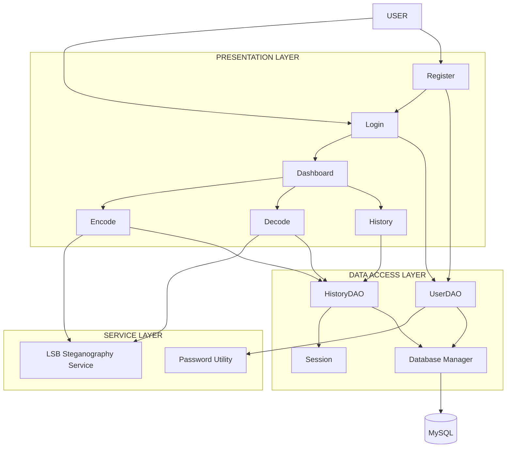
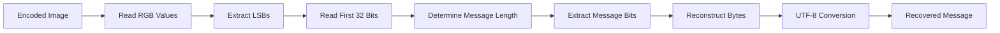
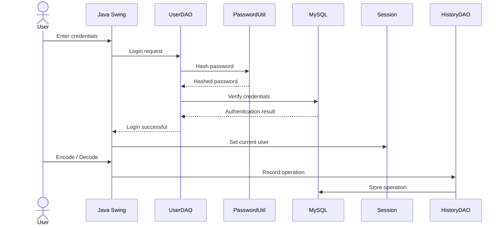

<div align="center">

# 🔐 SECURE IMAGE STEGANOGRAPHY TOOL

### Hide Information. Preserve the Image.

**A Java-based cybersecurity application for embedding and extracting secret text messages inside digital images using Least Significant Bit (LSB) steganography.**

<br>


<br>

**Steganography · Java · Image Processing · JDBC · MySQL · Secure Data Handling**

</div>

---

# ◼ Project Overview

**Secure Image Steganography Tool** is a desktop application developed using Java Swing that demonstrates the practical use of **information hiding** through image steganography.

The application hides text inside an image by modifying the **least significant bits of its RGB colour channels**. The visual appearance of the image remains effectively unchanged while the hidden message can later be extracted using the application.

The project extends beyond the core steganography algorithm by integrating:

* User authentication
* Password hashing
* Session management
* MySQL database connectivity
* User-specific operation history
* Dashboard statistics
* Image and file handling

The result is a complete desktop workflow rather than an isolated steganography algorithm.

---

# ◼ Why Steganography?

Encryption makes information unreadable.

**Steganography makes the information difficult to notice in the first place.**

```text
                    INFORMATION HIDING
                           │
             ┌─────────────┴─────────────┐
             │                           │
        ENCRYPTION                 STEGANOGRAPHY
             │                           │
             ▼                           ▼
      Hide the meaning            Hide the existence
             │                           │
             ▼                           ▼
       Ciphertext                  Ordinary-looking
                                   image containing
                                   hidden information
```

This project focuses on the second approach.

---

# ◼ What Makes the Project Complete?

```text
                         ┌───────────────────┐
                         │       USER        │
                         └─────────┬─────────┘
                                   │
                                   ▼
                         ┌───────────────────┐
                         │  AUTHENTICATION   │
                         └─────────┬─────────┘
                                   │
                                   ▼
                         ┌───────────────────┐
                         │     DASHBOARD     │
                         └─────────┬─────────┘
                                   │
                ┌──────────────────┼──────────────────┐
                ▼                  ▼                  ▼
           ┌─────────┐       ┌─────────┐       ┌──────────┐
           │ ENCODE  │       │ DECODE  │       │ HISTORY  │
           └────┬────┘       └────┬────┘       └────┬─────┘
                │                 │                  │
                └─────────────────┼──────────────────┘
                                  ▼
                         ┌───────────────────┐
                         │   MYSQL DATABASE  │
                         └───────────────────┘
```

---

# ◼ Core Features

| Feature                   | Description                                              |
| :------------------------ | :------------------------------------------------------- |
| **LSB Encoding**          | Embeds UTF-8 text into image RGB channel LSBs            |
| **LSB Decoding**          | Extracts the hidden message from an encoded image        |
| **User Authentication**   | Registration and login using database-backed credentials |
| **Password Hashing**      | Passwords are hashed before database storage             |
| **Session Management**    | Maintains the currently logged-in user                   |
| **Operation History**     | Records encoding and decoding operations                 |
| **User-Specific History** | Displays history belonging to the active user            |
| **Dashboard**             | Displays total, encode and decode operation counts       |
| **Image Handling**        | Opens, processes and saves image files                   |
| **JDBC + MySQL**          | Persistent storage for users and operations              |

---

# ◼ System Architecture



---

# ◼ Encoding Pipeline

The encoding process is the technical core of the application.

```mermaid
flowchart LR

    A["Input Image"] --> B["Read Image"]
    B --> C["Secret Message"]
    C --> D["UTF-8 Conversion"]
    D --> E["Calculate Message Length"]
    E --> F["Capacity Check"]
    F --> G["Embed 32-bit Length"]
    G --> H["Embed Message Bits"]
    H --> I["Modify RGB LSBs"]
    I --> J["Generate Encoded Image"]
    J --> K["Save PNG"]
```



### Message Representation

Before embedding, the message is represented as:

```text
┌────────────────────────┬──────────────────────────────┐
│  32-bit Message Length │       UTF-8 Message         │
└────────────────────────┴──────────────────────────────┘
```

The **32-bit length field** tells the decoder how many bytes need to be reconstructed.

---

# ◼ Inside the LSB Technique

Every pixel contains three primary colour channels:

```text
                     PIXEL
                       │
             ┌─────────┼─────────┐
             ▼         ▼         ▼
           RED       GREEN      BLUE
             │         │         │
             ▼         ▼         ▼
         8-bit       8-bit      8-bit
          value       value      value
             │         │         │
             └─────────┼─────────┘
                       ▼
               Least Significant
                      Bit
```

For example:

```text
Before

RED       10110110
GREEN     11001001
BLUE      01110100

Hidden bits → 1 0 1


After

RED       10110111
GREEN     11001000
BLUE      01110101
```

Only the least significant bit is modified.

The application therefore stores information while making only minimal numerical changes to pixel values.

---

# ◼ Decoding Pipeline



---

# ◼ Authentication & Data Flow

The project combines application security with persistent database storage.



---

# ◼ User-Specific History

The application does not simply display every operation stored in the database.

The current session determines which records are retrieved:

```text
             Logged-in User
                   │
                   ▼
          Session.currentUser
                   │
                   ▼
              HistoryDAO
                   │
                   ▼
       WHERE username = ?
                   │
                   ▼
       ┌─────────────────────┐
       │ User's own records  │
       └─────────────────────┘
```

Each history entry contains:

```text
Username
Operation
Image Name
Date & Time
```

---

# ◼ Security Design

### Password Protection

```text
User Password
      │
      ▼
PasswordUtil
      │
      ▼
Hashed Password
      │
      ▼
     MySQL
```

### Parameterized Queries

Database operations use `PreparedStatement`:

```java
String sql =
    "SELECT * FROM users WHERE username=? AND password=?";

PreparedStatement ps =
    conn.prepareStatement(sql);

ps.setString(1, username);
ps.setString(2, hashedPassword);
```

This keeps SQL structure separate from user-supplied values.

---

# ◼ Technology Stack

<div align="center">

| Layer                    | Technology                 |
| :----------------------- | :------------------------- |
| **Programming Language** | Java                       |
| **Desktop UI**           | Java Swing                 |
| **Steganography**        | LSB                        |
| **Database**             | MySQL                      |
| **Connectivity**         | JDBC                       |
| **Image Processing**     | `ImageIO`                  |
| **File Handling**        | Java I/O / NIO             |
| **Collections**          | Java Collections Framework |

</div>

---

# ◼ Project Structure

```text
SecureImageSteganography/
│
├── src/
│   │
│   ├── database/
│   │   ├── DatabaseManager.java
│   │   ├── UserDAO.java
│   │   ├── HistoryDAO.java
│   │   └── Session.java
│   │
│   ├── service/
│   │   ├── LSBSteganographyService.java
│   │   ├── SteganographyService.java
│   │   └── PasswordUtil.java
│   │
│   ├── operation/
│   │   └── ...
│   │
│   ├── ui/
│   │   ├── LoginFrame.java
│   │   ├── RegisterFrame.java
│   │   ├── DashboardFrame.java
│   │   ├── EncodeFrame.java
│   │   ├── DecodeFrame.java
│   │   └── HistoryFrame.java
│   │
│   └── Main.java
│
├── lib/
│   └── mysql-connector-j.jar
│
└── README.md
```

---

# ◼ Application Preview

**Use only your actual application screenshots here.**

Create a `screenshots/` folder in the repository:

```text
screenshots/
├── login.png
├── dashboard.png
├── encode.png
├── decode.png
└── history.png
```

Then display them in a clean grid:

<table>
<tr>
<td width="50%">

### Login


</td>
<td width="50%">

### Dashboard


</td>
</tr>

<tr>
<td width="50%">

### Encoding


</td>
<td width="50%">

### Decoding


</td>
</tr>
</table>

### Operation History

<p align="center">

</p>

---

# ◼ Testing Coverage

The application was functionally tested across its major workflows.

| Module         | Test Area                     |
| :------------- | :---------------------------- |
| Authentication | Registration and login        |
| Validation     | Invalid / incomplete inputs   |
| Session        | Current-user tracking         |
| Encoding       | Message embedding             |
| Decoding       | Message extraction            |
| History        | Operation recording           |
| User History   | User-specific filtering       |
| Dashboard      | Operation statistics          |
| Image Handling | Opening and saving images     |
| Database       | JDBC connectivity and queries |

---

# ◼ Limitations

* Currently designed for **text-based information hiding**.
* LSB data may be affected by subsequent image compression or processing.
* Steganography itself does not provide cryptographic encryption.
* Database credentials require local configuration.
* The current implementation is a Java desktop application.

---

# ◼ Future Scope

```text
                    CURRENT SYSTEM
                          │
          ┌───────────────┼────────────────┐
          │               │                │
          ▼               ▼                ▼
     Encryption      More Formats     Stronger Auth
          │               │                │
          └───────────────┼────────────────┘
                          ▼
                 Improved Security
                          │
          ┌───────────────┼────────────────┐
          ▼               ▼                ▼
      Integrity       Analytics       Export History
       Checks
```

Potential enhancements include:

* **Encryption before embedding**
* Support for additional image formats
* Stronger authentication mechanisms
* Improved image-integrity validation
* Drag-and-drop image processing
* Enhanced dashboard analytics
* Exportable operation history

---

# ◼ Getting Started

## Requirements

* **JDK 17+**
* **MySQL Server**
* **MySQL Workbench**
* **MySQL Connector/J**

## Database Setup

```sql
CREATE DATABASE steganography_db;

USE steganography_db;

CREATE TABLE users (
    username VARCHAR(100) PRIMARY KEY,
    password VARCHAR(255) NOT NULL
);

CREATE TABLE history (
    id INT AUTO_INCREMENT PRIMARY KEY,
    username VARCHAR(100) NOT NULL,
    operation VARCHAR(50) NOT NULL,
    image_name VARCHAR(255),
    date_time TIMESTAMP DEFAULT CURRENT_TIMESTAMP
);
```

Configure the local database credentials in:

```text
src/database/DatabaseManager.java
```

## Compile

```powershell
javac -cp "lib/*" -d bin src/Main.java src/database/*.java src/service/*.java src/ui/*.java src/operation/*.java
```

## Run

```powershell
java -cp "bin;lib/*" Main
```

---

# ◼ Academic Context

**Project:** Secure Image Steganography Tool
**Domain:** Cybersecurity and Information Security
**Course:** Java Programming — Project-Based Learning

### Developed By

**Zohra Fakrudeen Ali**
B.E. Computer Science and Engineering — Cybersecurity

**Srimathi S**
B.E. Computer Science and Engineering — Cybersecurity

---

<div align="center">

## 🔐 SECURE IMAGE STEGANOGRAPHY TOOL

**Conceal the message. Preserve the image.**

*Built with Java • LSB Steganography • JDBC • MySQL*

</div>

